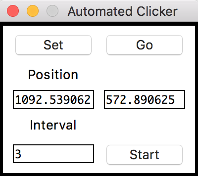

# Auto Clicker

Auto Clicker is a lightweight app that enables users to register mouse positions and create periodic clicking to those positions.

### Installation

After cloning, you can either simply run it with python:
```sh
$ python AutoClicker.py
```

The required packages are:
- Tkinter
- pynput 1.6.8

or create an app with the usage of py2app:
```sh
$ py2applet --make-setup AutoClicker.py
$ python setup.py py2app
```
The app will be then in the ```./dist``` directory:
```
$ ./dist/AutoClicker.app
```

### Usage



After running the app the workflow is as follows: 
- **Set**: After clicking **Set** we can move the mouse to the position we want to set and click. The mouse position will then be loaded to the two text boxes below "Position".
- **Go**: Clicking **Go** will move the mouse to the position written in the text boxes and left-click once.
- **Start**: Clicking **Start** will create a scheduled job of moving the mouse to the specified position and left-click once in an interval (in seconds) specified in the box below "Interval".

**Note**: Using a 1 second interval will make it hard to stop the program. 